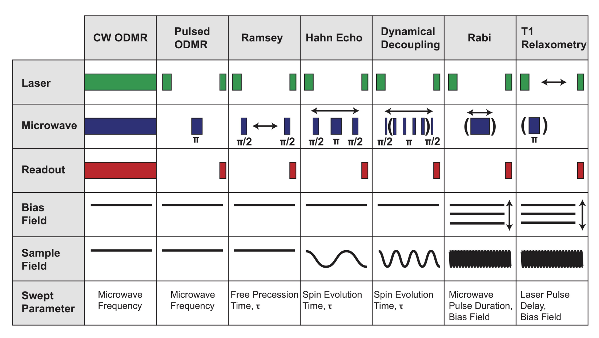
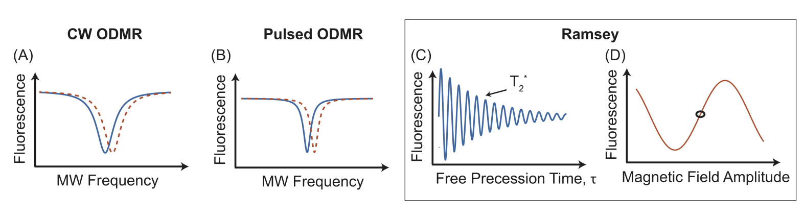
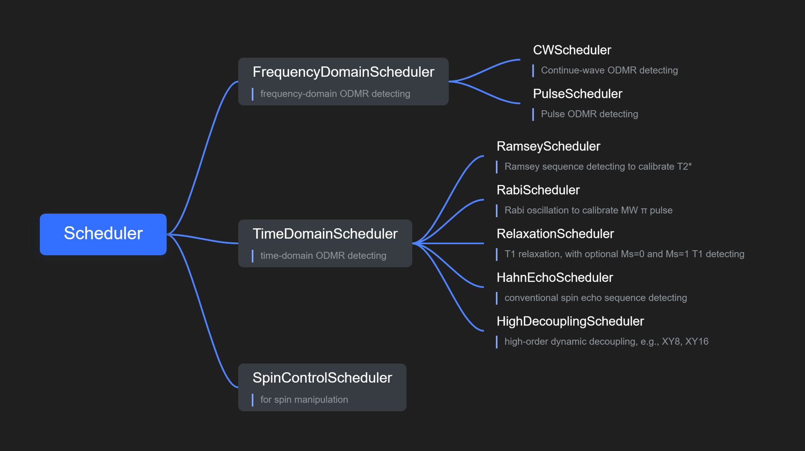
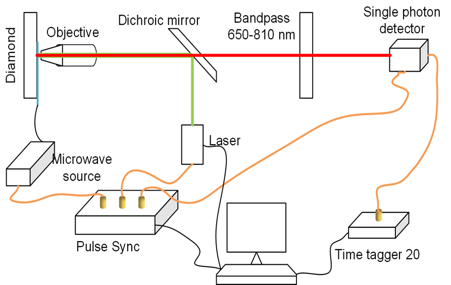

# Odmactor (ODMR Actor)

ODMR software SDK integrating functions of ODMR detection and spin manipulation.

*This project is on continuous updating & using ...*

> Last updating date: April, 2022<br>
> Current implementation: ODMR detection

## Design Method

### Measurement modes and scheduling strategies

1. Frequency-domain detection<br>
   *Scan MW frequencies*
    - Continuous-Wave ODMR
        1) polarize spin systems
        2) operate continuous MW and readout signals for the whole sequence period
    - Pulse ODMR
        1) polarize spin systems
        2) apply a fixed-interval MW pulse
        3) readout final fluorescence signals
2. Time-domain detection<br>
   *Scan time intervals*
    - Ramsey detection
        1) initialize spin to ground state
        2) initialize spin to equal-amplitude superposition state using calibrated MW $\frac{\pi}{2}$ pulse
        3) wait for a time interval $\tau$
        4) operate a calibrated MW $\frac{\pi}{2}$ pulse again
        5) readout final spin state (population)
    - Rabi oscillation
        1) initialize spin to ground state
        2) operate a short MW pulse (100~200 ns)
        3) readout final spin state (population)
    - T1 relaxation
        1) initialize spin to excited state using calibrated MW $\pi$ pulse
        2) wait a time interval $\tau$
        3) readout final spin state (population)
    - Hahn echo
      Sequences are similar with those for Ramsey detecting, while there is an additional MW π pulse between the two π/2 pulses.
    - High-order dynamical decoupling
      Sequences are similar with those for Ramsey detecting, while there are N additional MW π pulse between the two π/2 pulses.
3. Spin manipulation<br>
   *Currently not implemented*

The above specific scheduling methods could be abstracted into different detection sequences in experiments. They are
all controlled in precision of "ns".



Thus the series of ODMR measurement experiments is simplified by a "pipeline". CW and Pulse ODMR could be used to
characterize environmental physical quantities, while they also could be used to calibrate energy gap or fine
structures. Ramsey detecting is usually used to characterize T2* (dephasing time) of spin systems. Some typical results
of them are like the following figure.



### OOP Classes implementation



**general scheduling methods**

- `scheduler.config_odmr_seq()`: configure ASG control sequences for laser, MW and tagger
- `schedulel.stop()`: stop all hardware (ASG, MW, Tagger) scheduling
- `schedulel.close()`: release instrument (ASG, MW, Tagger) resources
- `schedulel.save_result()`: save detailed measurement result into a ".json" file

**necessary data fields of schedulers**

- `scheduler.channel`: a `dict` instance in Python, presenting ASG channels to output control sequences
- `scheduler.tagger_input`: a `dict` instance in Python, presenting Tagger input channels (signal, trigger, etc.)
- `scheduler.result`: a `list` instance in Python, consisting of aggregated (avg or mean) measurement result
- `scheduler.result_detail`: a `dict` instance in Python, consisting of detailed measurement result
- `scheduler.pi_pulse`: `{'freq': ..., 'power': ..., 'time': ...}`, consisting of configuration information of the
  calibrated MW $\pi$ pulse
- `scheduler.sequences`: rational ASG sequences data in form of lists
- `scheduler.sequences_figure`: visualized ASG control sequences

**specific scheduling methods**

- `scheduler.run_scanning()`: for `FrequencyDomainScheduler` and `TimeDomainScheduler`, scan time intervals and MW
  frequencies, respectively
- `scheduler.run_single_step()`: for `FrequencyDomainScheduler` and `TimeDomainScheduler`, run a single setting point
- `scheduler.set_delay_times()`: for `TimeDomainScheduler`, this function should be called to design time interval
  scanning points
- `scheduler.set_mw_freqs()`: for `FrequencyDomainScheduler`, this function should be called to design MW frequency
  scanning points

## Hardware support

### General ODMR platform



### Specific hardware used

Most general hardware resources are supported by our Odmactor programs. Below are some essential instruments usde in a systematic
ODMR platform and directly controlled by our programs currently used in our [QIM](https://quantum.lab.arizona.edu/) group. 

**Arbitrary Sequence Generator (ASG)**

This is the most important instrument to synchronize control measurement processes.

- Vendor: [CIQTEK](https://www.ciqtek.com/)
- Type: ASG8005
- Feature: 8 control channels

**Microwave instrument (MW)**

- Vendor: [R&S](https://www.rohde-schwarz.com)
- Type: [SMB 100A](https://www.rohde-schwarz.com/us/products/test-and-measurement/analog-signal-generators/rs-smb100a-microwave-signal-generator_63493-9379.html)

**Time Tagger (Tagger)**

This is a T/D convertor as well as A/D convertor necessary for data acquisition.

- Vendor: [Swabian](https://www.swabianinstruments.com/)
- Type: [Time Tagger 20](https://www.swabianinstruments.com/time-tagger/)
- Feature: 8 detecting channels, 34 ps jitter, 8 M tags/s

**Lock-in Amplifirer**

Lock-in is a mature manner to detect weak signals, and this device manufactured by Standford Research
is a usual lock-in amplifier.

- Vendor: [Stanford Research](https://www.thinksrs.com/)
- Type: [RS830](https://www.thinksrs.com/products/sr810830.htm)
- Feature: 1 mHz ~ 102.4 kHz range, 0.01 degree resolution

**Data Acquisition board**

NI DAQ device is used when using lock-in detecting mode instead APD with Time Tagger mode.

- Vendor: [National Instruments](https://www.ni.com/)


## Usage method

### Basic steps

- Configuration
    1. Set channels of ASG
    2. Set parameters (e.g. frequencies, power) of MW
    3. Configure pulse sequences for ODMR experiments
    4. Configure the counting module of Tagger
- Start devices & Acquire data
    1. run the "scheduler" (e.g. execute `scheduler.run()` method)
    2. the result will be saved into properties `scheduler.result` and `scheduer.result_detail`
- Analysis & Visualization
    1. visualize your result (e.g. contrast figure, counting figure corresponding to frequencies)
    2. use suitable analytical functions to fit your data curve

### Code example

More examples could be found in the [example](./example/) folder. Herein is a typical scheduling pipeline instance.

```python
# ------- Pulse ODMR Measurement -------
# configure parameters
channel_dict = {
    'laser': 1,
    'mw': 2,
    'apd': 3,
    'tagger': 5
}
tagger_input = {'apd': 1, 'asg': 2}

scheduler = PulseScheduler()  # Pulse-ODMR scheduler instance
scheduler.channel = channel_dict  # set ASG control channels
scheduler.tagger_input = tagger_input  # set tagger input channels
scheduler.configure_mw_paras(power=10)  # configure MW power
scheduler.configure_odmr_seq(t_init, t_mw, t_read_sig=400, t_read_ref=400, inter_init_mw=inter_init_mw, N=N)
scheduler.set_mw_freqs(freq_start, freq_end, freq_step)  # set measured frequencies
scheduler.configure_tagger_counting(reader='cbm')  # 'Counter Between Markers' measurement mode

# run
scheduler.run_scanning()
scheduler.save_result(fname)  # actually, this method is automatically called in the run_scanning() method

# result analysis
counts_sig_ref = scheduler.result  # [freqs, counts, counts_reference]
contrast = [sig / ref for sig, ref in
            zip(counts_sig_ref[0], counts_sig_ref[1])]  # calculate contrast (relative fluorescence intensity)
```

## Addition

### GUI software

A Graphical User Interface (GUI) version software based on this SDK is also implemented and has been used well in
our [QIM](https://quantum.lab.arizona.edu/) group. It is also published on the author's [GitHub page](https://github.com/Youngcius/odmactor-gui).

### Frequently Asked Questions

**Q: Where should I get to know more about Odmactor?**

**A:** If you have more demand or cooperation willingness, please contact to
the [Quantum Information and Materials Group](https://quantum.lab.arizona.edu) of the University of Arizona.

**Q: Can I modify this set of programs for my own research?**

**A:** Of course. The Odmactor is a set of open-source programs for promising research and education. We are glad that
more people can use or modify it. If you have more ideas or suggestions, welcome to contact to us!

### Copyright and License

Odmactor uses the [MIT license](LICENSE).

